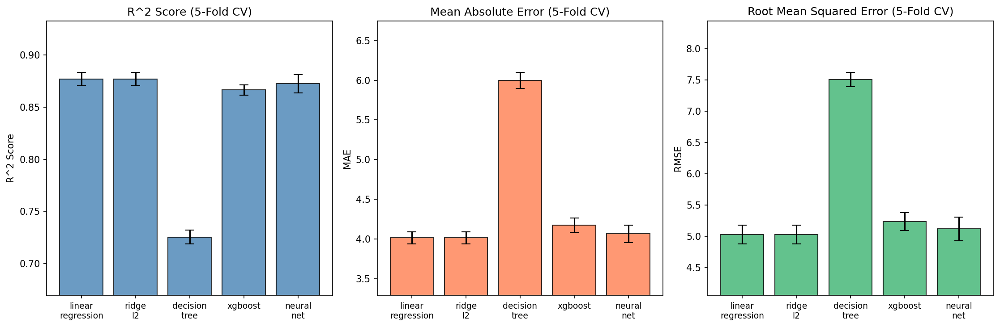
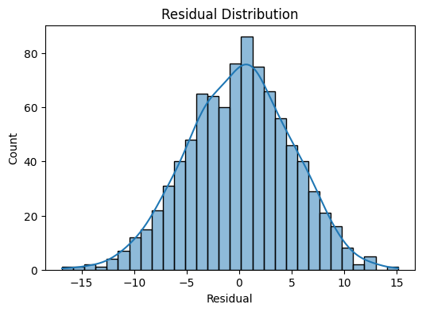
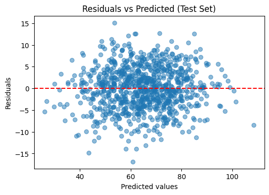
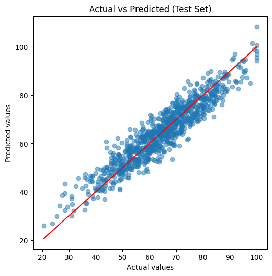
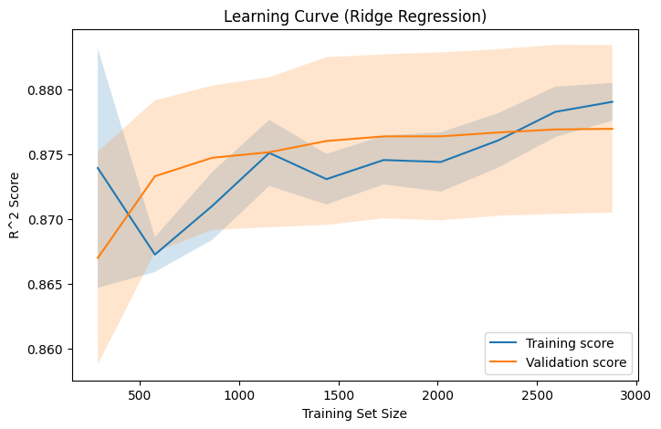
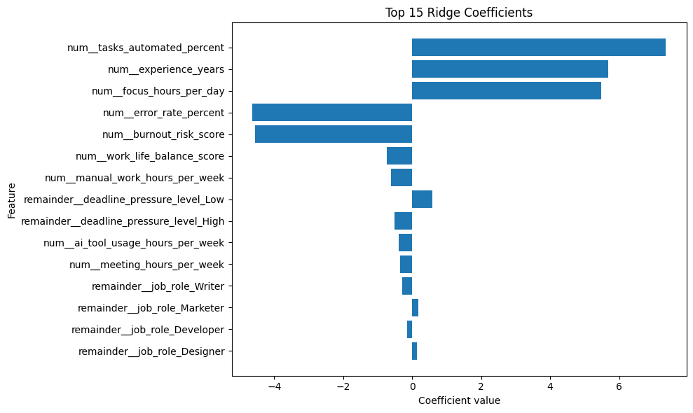

# Regression Model Comparison for Productivity Prediction in AI-Augmented Environments


## Overview

This project benchmarks six regression models on the task of predicting worker productivity scores in AI-augmented workplace environments. Using a structured dataset of 4,500 employees with 14 features spanning work patterns, AI usage, and wellbeing indicators, we systematically evaluate model performance across the complexity spectrum — from simple mean predictors to gradient-boosted trees and neural networks.

The key finding: **Ridge L2 Regression outperforms all more complex models**, achieving R² = 0.8788 on the held-out test set. This result suggests the underlying relationships in the data are largely linear, and that additional model complexity yields no meaningful benefit.

---

## Problem Statement

As AI tools become embedded in modern workplaces, understanding what drives productivity becomes increasingly valuable. Can we predict a worker's productivity score from structured features describing their experience, working habits, AI usage, and wellbeing? This project investigates that question through a rigorous regression model comparison, with an emphasis on reproducibility, principled hyperparameter selection, and statistical validation of results.

---

## Models Compared

| Model | Type |
|---|---|
| Mean Predictor | Baseline (no learning) |
| Linear Regression | Baseline (ordinary least squares) |
| Ridge L2 Regression | Regularized linear |
| Decision Tree | Non-linear, tree-based |
| XGBoost | Gradient-boosted ensemble |
| Neural Network (MLP) | Feed-forward, 1–4 hidden layers |

---

## Methodology

- **Dataset**: 4,500 employees × 14 features (worker background, AI usage, workplace conditions)
- **Target**: Continuous productivity score (range: 20.5–100)
- **Train/test split**: 80/20, fixed random seed
- **Validation**: 5-fold cross-validation on training data
- **Hyperparameter optimization**: Simulated annealing (`scipy.optimize.dual_annealing`), 50 iterations per model, maximizing mean R² across folds
- **Preprocessing**: Standard scaling on numerical features; one-hot encoding for categorical features (applied within CV pipeline to prevent data leakage)
- **Metrics**: MAE, RMSE, R²

---

## Results

### Cross-Validation Performance (5-Fold)

| Model | MAE | RMSE | R² |
|---|---|---|---|
| Mean Predictor (Baseline) | 11.25 | 14.11 | -0.0004 |
| Linear Regression (Baseline) | 4.0139 ± 0.0774 | 5.0261 ± 0.1511 | 0.8770 ± 0.0064 |
| **Ridge L2 Regression** | **4.0133 ± 0.0756** | **5.0258 ± 0.1499** | **0.8771 ± 0.0064** |
| XGBoost | 4.1715 ± 0.0932 | 5.2355 ± 0.1440 | 0.8665 ± 0.0049 |
| Neural Network | 4.0657 ± 0.1095 | 5.1160 ± 0.1876 | 0.8724 ± 0.0086 |
| Decision Tree | 5.9994 ± 0.1011 | 7.5083 ± 0.1144 | 0.7255 ± 0.0066 |

### Final Test Set Evaluation (Ridge L2)

| Metric | Value |
|---|---|
| MAE | **3.9428** |
| RMSE | **4.9105** |
| R² | **0.8788** |

Statistical significance: paired t-tests across CV folds confirm Ridge and Linear Regression are statistically equivalent (p = 0.4487), while Decision Tree, XGBoost, and Neural Network all differ significantly (p < 0.05).

---

## Key Findings

**Strongest positive predictors of productivity:**
- `tasks_automated_percent` (coef: +7.36) — higher task automation correlates strongly with higher productivity
- `experience_years` (coef: +5.69) — more experienced workers are more productive
- `focus_hours_per_day` (coef: +5.49) — dedicated deep-work time drives output

**Strongest negative predictors:**
- `error_rate_percent` (coef: −4.63) — higher error rates reduce productivity
- `burnout_risk_score` (coef: −4.56) — burnout is a significant productivity drain

These results align with findings in the broader AI-productivity literature: AI assistance benefits experienced workers most, and burnout and errors act as strong counterweights.

---

## Results Visualizations

### Model Comparison (5-Fold Cross-Validation)


### Residual Analysis (Ridge L2 — Test Set)




### Learning Curve (Ridge L2)


### Top Ridge Regression Coefficients


---

## Repository Structure

```
.
├── data/
│   ├── ai_productivity_features.csv     # Raw feature data (4,500 employees × 14 features)
│   ├── ai_productivity_targets.csv      # Raw target variables
│   ├── cleaned_data.csv                 # Merged and cleaned dataset
│   ├── cleaned_data_scaled.csv          # Scaled version (numerical features standardized)
│   └── cleaned_data_unscaled.csv        # Unscaled version (for interpretability)
├── notebooks/
│   ├── preprocessing.ipynb              # Data cleaning, EDA, feature engineering
│   └── split_and_evaluate.ipynb         # Model training, CV, hyperparameter search, evaluation
├── results/
│   ├── model_comparison_cv.png          # Bar chart comparing all models on 3 metrics
│   ├── residual_distribution.png        # Histogram of residuals (Ridge, test set)
│   ├── residual_vs_predicted.png        # Residuals vs predicted scatter (Ridge, test set)
│   ├── actual_vs_predicted.png          # Actual vs predicted values (Ridge, test set)
│   ├── learning_curve.png               # Learning curve showing train/val R² vs data size
│   ├── bar_graph.png                    # Top 15 Ridge coefficients by absolute magnitude
│   ├── correlation_heatmap.png          # Feature correlation matrix
│   ├── histogram_productivity.png       # Distribution of target variable
│   └── scatterplot_matrix.png           # Pairwise feature scatter plots
├── report/
│   └── regression_model_comparison_ai_productivity.pdf   # Full research paper
├── README.md
├── requirements.txt
└── .gitignore
```

---

## Installation & Usage

**1. Clone the repository**
```bash
git clone https://github.com/georgeded/regression-model-comparison-ml.git
cd regression-model-comparison-ml
```

**2. Install dependencies**
```bash
pip install -r requirements.txt
```

**3. Run the notebooks**

Open Jupyter and run in order:
```bash
jupyter notebook
```

- `notebooks/preprocessing.ipynb` — data cleaning, EDA, saves cleaned CSVs to `data/`
- `notebooks/split_and_evaluate.ipynb` — model training, hyperparameter search, evaluation, saves plots to `results/`

---

## Tech Stack

- **Python 3.10+**
- **scikit-learn** — Linear Regression, Ridge, Decision Tree, MLPRegressor, cross-validation, scaling
- **XGBoost** — gradient-boosted tree ensemble
- **SciPy** (`dual_annealing`) — simulated annealing for hyperparameter optimization
- **pandas / NumPy** — data manipulation
- **Matplotlib / Seaborn** — visualization
- **Jupyter** — interactive notebooks

---

## Full Report

The complete research paper with methodology, results, and discussion is available in [`report/regression_model_comparison_ai_productivity.pdf`](report/regression_model_comparison_ai_productivity.pdf).
